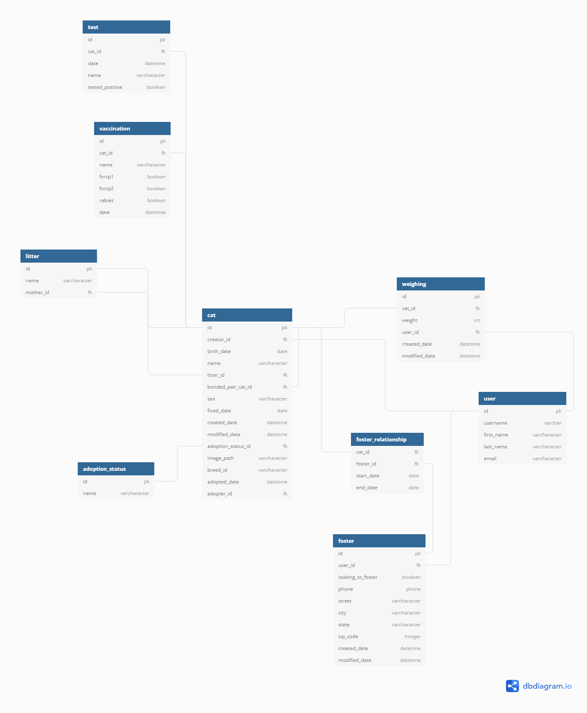

# FOSTERITE RESTful API 

This is the back-end counterpart to the full-stack [Fosterite Web App](https://github.com/keithrpotempa/fosterite-web-app). A full description of the app can be found there. 

# Project Setup

1. Clone the repo and cd into it:

    `git clone git@github.com:keithrpotempa/fosterite-api.git && cd $_`

1. Set up your virtual environment:

    `python -m venv fosteriteEnv`

1. Activate virtual environment:

    `source ./fosteriteEnv/bin/activate`

1. Install dependencies:

    `pip install -r requirements.txt`

1. Run migrations:

    `python manage.py makemigrations`
    `python manage.py migrate`

1. Load fixtures:

    `python manage.py loaddata */fixtures/*.json`

1. Start the API server:

    `python manage.py runserver`

1. Follow the [steps on the front-end web app readme](https://github.com/keithrpotempa/fosterite-web-app) to view the web app in your browser

## Technology Utilized
1. Django
1. Python
1. SQLite
1. Fixtures
1. ORM & SQL queries
1. Models
1. API Endpoint Views  
1. Testing with unittest
1. User authentication with authtoken
1. url routing

## Entity Relationship Diagram

